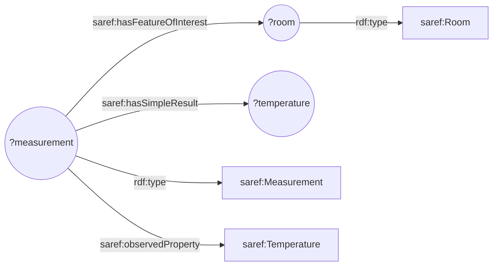

Java Developer API
==================
As a developer, you might be thinking "this all seems awfully complex and painful".
If that sounds like you, we have good news: you don't have to bother with most of it!

This section explains the Java Developer API of the Knowledge Engine. The requirements of the Knowledge Engine are described in Test Cases and can be found [here](./04_test_cases.md).

We provide an implementation of a SmartConnector that you can instantiate as a Java object.
You are responsible for:

- Registering the knowledge that your knowledge base requests or provides.
- Implementing handlers that are called when certain knowledge is requested or provided.

TODO: Add instructions on how to use it in a Maven project once that's possible. (Also how to include it as a jar?)

The SmartConnector uses this to register itself in the knowledge network.
The following subsections further explain how a SmartConnector can be instantiated and, how the different kinds of knowledge can be registered.

## Instantiating and configuring a SmartConnector

TODO: Show how to instantiate a `SmartConnector`, and explain that it needs network ports.

```java
SmartConnector sc = new SmartConnectorImpl();
```
TODO: Update with new constructor to show the configuration.

## Registering and making Knowledge Requests
Currently, a SmartConnector is required to register the patterns of knowledge that it will request from the network. (See #67)

A knowledge request can be registered as follows:
```java
QueryKnowledgeIO asksForTemperatureMeasurements = new QueryKnowledgeIO(prefixMapping, graphPattern);
sc.register(
    asksForTemperatureMeasurements
);
```
where `graphPattern` is a string describing an RDF graph pattern where variables are prefixed with a `?`.

As an example, assume `graphPattern` is the following graph pattern:
```sparql
?measurement rdf:type saref:Measurement .
?measurement saref:hasFeatureOfInterest ?room .
?room rdf:type saref:Room .
?measurement saref:observedProperty saref:Temperature .
?measurement saref:hasSimpleResult ?temperature .
```
It can be illustrated with this diagram:

where the variables are represented by circles and the fixed URIs are represented by rectangles.

The graph pattern above matches on temperature measurements in rooms.

### Querying the network

When querying the network for the pattern, the variables (`?measurement`, `?room`, and `?temperature`) can be bound to known values, to limit the possible matches.

For example, if we know that there's a room called `https://www.example.org/kitchen`, we can set up the bindings as such:
```java
Set<Binding> queryBindings = new HashSet<Binding>();
queryBindings.add(new Binding(new String[][] {{ "room", "<https://www.example.org/kitchen>" }}));
```
and subsequently query for matches:
```java
Set<Binding> resultBindings = sc.query(asksForTemperatureMeasurements, queryBindings);
```
The results from the knowledge network are in the set of bindings.

## Registering Knowledge Provisions
## Registering Knowledge Channels
## Registering Knowledge Subscriptions
