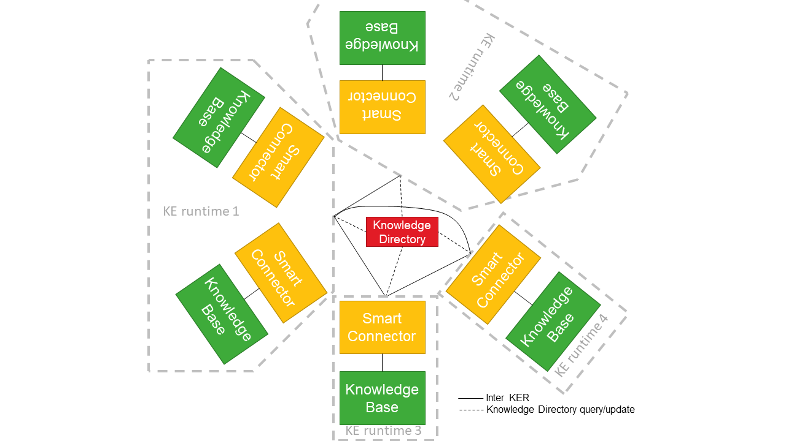

Distributed mode
================

This section contains information about running the knowledge engine in distributed mode. This mode requires a central component called the knowledge directory (KD). The only responsibility of the KD is keeping track of all registered Knowledge Engine runtimes (KE runtime). The different KE runtimes use the KD to find other KE runtimes with whom they can exchange data. Note that KE runtimes communicate with each other directly and the knowledge directory does not mediate in this process.  

*Figure 1: different knowledge engine.*

### Starting the Knowledge Engine in distributed mode

A minimal example showing how to configure it in distributed mode can be found in [`./examples/multiple-runtimes/`](./examples/multiple-runtimes/).

First of all, you need to start a knowledge directory. The desired port number for the knowledge directory can be configured using the command line argument (8080 in the example below).

```bash
cd knowledge-directory/target/

java -Dorg.slf4j.simpleLogger.logFile=kd.log -cp "knowledge-directory-1.2.0.jar:dependency/*" eu.knowledge.engine.knowledgedirectory.Main 8080
```

As explained in the local mode section, `nohup` can be used to run the process in the background. On overview of the registered Knowledge Engine runtimes can be found on `http://localhost:8080/ker/` (or another host or port if you desire).

Once the knowledge directory is up and running, the REST server can be started. It is configured through environment variables. It has the following configuration options:

| Key    | Descrption                                     |
|--------|------------------------------------------------|
| KD_URL | URL where the knowledge directory can be found |
| KE_RUNTIME_EXPOSED_URL | URL where other smart connectors (peers) can contact this Knowledge Engine instance. This allows your Knowledge Engine to be behind a reverse proxy and use TLS. Note that the URL should include the scheme like `http://...` or `https://...`.
| KE_RUNTIME_PORT | Port where where this Knowledge Engine instance will listen for new peer connections |
| KE_RUNTIME_HOSTNAME (deprecated) | Hostname where other smart connectors (peers) can contact this Knowledge Engine instance. This variable is superseded by (and conflicts with) KE_RUNTIME_EXPOSED_URL|

Note that the port for the REST API for the Knowledge Bases is still configured through the command line argument.

```bash
cd smart-connector-rest-dist/target

export KD_URL=http://localhost:8080
export KE_RUNTIME_EXPOSED_URL=http://localhost:8081
export KE_RUNTIME_PORT=8081

java -Dorg.slf4j.simpleLogger.logFile=ke.log -cp "smart-connector-rest-dist-1.2.0.jar:dependency/*" eu.knowledge.engine.rest.Main 8280
```

As explained in the local mode section, `nohup` can be used to run the process in the background.