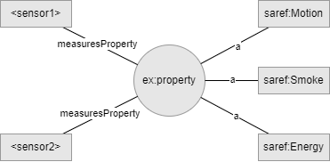

# Writing Graph Patterns
This page discusses some good practices for writing graph patterns.

## How to handle redundant variables if they are required in a graph pattern
:::tip
This is a common pitfall, so we recommend having a look at this section!
:::

Let's take the following graph pattern as an example, which defines a device which measures a property, and the type of that property.

```sparql
?device <https://saref.etsi.org/core/measuresProperty> ?property .
?property a ?propertyType .
```

This graph pattern contains three variables: `device`, `property` and `propertyType`.
What should you do when you are only interested in `device` and `propertyType`, but not in `property`?

This case often occurs and a common pitfall is that people replace the `property` variable by a placeholder individual, 
e.g. : `http://example.org/property#property`.
The resulting pattern would then look like this:

```sparql
?device <https://saref.etsi.org/core/measuresProperty> <http://example.org/property#property> .
<http://example.org/property#property> a ?propertyType .
```

However, this causes a problem. 
Let's distinguish between syntax and semantics here.
The graph pattern above is syntactically correct, and is accepted by the Knowledge Engine.
However, there is some difficulty with the semantics that it expresses.

Imagine the following binding set:

```json
{
  "device": "<sensor1>",
  "propertyType": "saref:Motion"
},
{
  "device": "<sensor1>",
  "propertyType": "saref:Smoke"
},
{
  "device": "<sensor2>",
  "propertyType": "saref:Energy"
}
```

If we combine the above Graph Pattern with the above BindingSet, we get the following RDF triples:

1. `<sensor1> <https://saref.etsi.org/core/measuresProperty> <http://example.org/property#property> .`
2.   `<http://example.org/property#property> a saref:Motion .`
3. `<sensor1> <https://saref.etsi.org/core/measuresProperty> <http://example.org/property#property> .`
4. `<http://example.org/property#property> a saref:Smoke .`
5. `<sensor2> <https://saref.etsi.org/core/measuresProperty> <http://example.org/property#property> .`
6. `<http://example.org/property#property> a saref:Energy .`

Now, if we draw these triples as a graph, we get something like:



While we had 6 RDF triples, we only see 5 edges in this figure!
This is caused by the fact that the 1st and 3rd triple of the graph pattern above are exactly the same and triples can only occur once in a graph.
So, if you write them twice, they will still only occur once.
So, by using a fixed individual for `property` in the graph pattern, it becomes semantically impossible to determine that `sensor1` is measuring the property Motion and Smoke, while sensor2 is measuring Energy!

Therefore, while using a fixed property is syntactically correct, it is semantically incorrect.
Using a fixed property in the current version of the KE (with a matcher instead of a reasoner) will probably work fine and the data is exchanged as expected.
This is, however, probably not the case with the future version of the KE with reasoner, because the reasoner will actually semantically interpret the graph pattern and binding set and when you ask something like:

  ```sparql
  ?device <https://saref.etsi.org/core/measuresProperty> <http://interconnectproject.eu/pilots/greek/property#property> .
  <http://interconnectproject.eu/pilots/greek/property#property> a saref:Energy .
  ```
  This graph pattern represents the query: “give me all devices that measure energy” and it will answer with the following bindingset:

```json
{
  "device": "<sensor1>"
},
{
  "device": "<sensor2>"
}
```

Which is not correct and is caused by the fixed property.
So, there are two solutions here.
1. The practical one, which I think happens quite a lot, is for the ontology to provide an individual per property.
So, you would have a `ex:motionIndividual`, `ex:energyIndividual` and `ex:smokeIndividual`.
These can be used instead of the ex:property and will make sure that it remains semantically correct.
2. A less practical (and philosophically debatable) one is to have a unique property individual for every property a device measures.
So, you would get something like `<sensor1/individual/motion>`, `<sensor1/individual/smoke>` and `<sensor2/individual/energy>` and even more for all other devices.

## Can you use volatile IRIs or should you use static or stored reference IRIs?
Let's say we have some graph pattern like:

```sparql
?timeseries rdf:type ex:Timeseries .
?timeseries ex:hasMeasurement ?measurement .
?measurement rdf:type saref:Measurement .
?measurement saref:hasFeatureOfInterest ?room .
?room rdf:type saref:Room .
?measurement saref:observedProperty saref:Temperature .
?measurement saref:hasSimpleResult ?temperature .
?measurement ex:hasTimestamp ?ts .
```

And the timeseries returns an array of temperature values and timestamp for each value.
The binding set will be something like:
```json
[
	{
		"timeseries": "<https://www.example.org/timeseries-sensora-b-23>",
		"measurement": "<https://www.example.org/measurement-42>",
		"room": "<https://www.example.org/kitchen>",
		"temperature": "\"21.2\"^^<http://www.w3.org/2001/XMLSchema#float>",
		"ts": "\"2020-10-16T22:00Z\"^^some_timestamp_type"
	},
	{
		"timeseries": "<https://www.example.org/timeseries-sensora-b-23>",
		"measurement": "<https://www.example.org/measurement-43>",
		"room": "<https://www.example.org/kitchen>",
		"temperature": "\"21.4\"^^<http://www.w3.org/2001/XMLSchema#float>",
		"ts": "\"2020-10-16T23:00Z\"^^some_timestamp_type"
	}
]
```

If you use a temporal or volatile IRI for the measurement, that would mean that you cannot retrieve more details for the object later (assuming an appropriate interaction exists).
It is therefore recommended to use a stored or static IRI.
In the case of measurements or observations, you could also choose an IRI like so: `<https://www.example.org/sensor/[sensor]/ts/[timestamp]>`, where you add the timestamp (e.g. in unix format) and a reference to the sensor doing the measurement.
This makes it easy to later reconstruct the IRI when you want to request more info.
