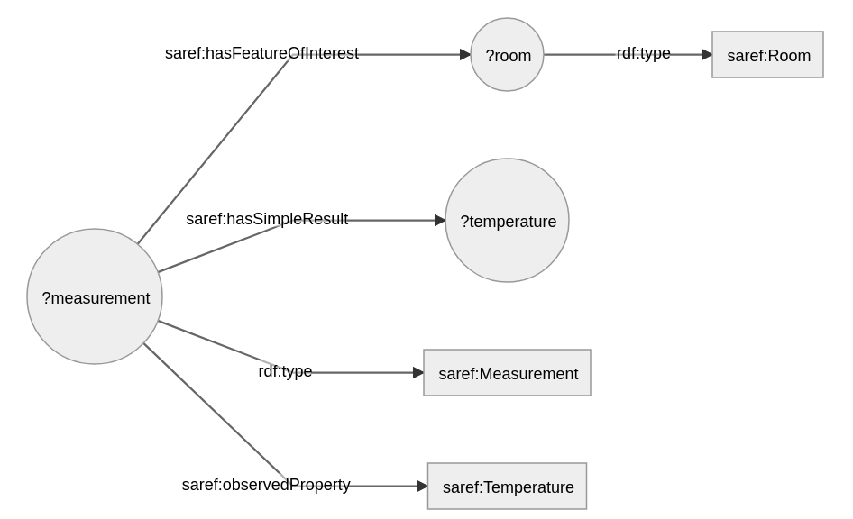

# Getting Started

As a developer, you might be thinking "this all seems awfully complex and painful".
If that sounds like you, we have good news: you don't have to bother with most of it!

This section will take you through the main steps that are needed to get started.
We will show this using the Java Developer API, but it can also be done using the [REST Developer API](https://github.com/TNO/knowledge-engine/blob/master/smart-connector-rest-server/src/main/resources/openapi-sc.yaml).

We provide an implementation of a `SmartConnector` that you can instantiate as a Java object.
When you want to exchange information within a Knowledge Network, you are responsible for:

- Registering the knowledge that your knowledge base requests or provides.
- Implementing handlers that are called when certain knowledge is requested or provided.

<!-- TODO: Add instructions on how to use it in a Maven project once that's possible. (Also how to include it as a jar?) -->

The SmartConnector uses this to register itself in the knowledge network.
The following sections further explain how a SmartConnector can be instantiated and, how you can register the knowledge that your knowledge base provides.

## Instantiating and Configuring a SmartConnector

<!-- TODO: Show how to instantiate a `SmartConnector`, and explain that it needs network ports. -->

Assuming `this` is your knowledge base, you can make a `SmartConnector` as follows:

```java
SmartConnector sc = SmartConnectorBuilder.newSmartConnector(this).create();
```

## Registering and Using Knowledge Interactions
Currently, a SmartConnector is required to register the patterns of knowledge that it will request from the network.

A knowledge request can be registered as follows:
```java
AskKnowledgeInteraction asksForTemperatureMeasurements = new AskKnowledgeInteraction(graphPattern);
sc.register(
    asksForTemperatureMeasurements
);
```
where `graphPattern` is a string describing an RDF graph pattern where variables are prefixed with a `?`.

Graph patterns consist of one or more triples separated by a dot (.) and each triple consists of a subject, predicate and object node.
Each node can be either a variable (using a question mark `?var` prefix), a URI (using the `<https://...>` or a literal (using quotes `"hello"`).
Graph Pattern syntax is based on W3C's [SPARQL 1.1 basic graph patterns](https://www.w3.org/TR/rdf-sparql-query/#BasicGraphPatterns).

As an example, assume `graphPattern` is the following graph pattern:
```sparql
?measurement rdf:type saref:Measurement .
?measurement saref:hasFeatureOfInterest ?room .
?room rdf:type saref:Room .
?measurement saref:observedProperty saref:Temperature .
?measurement saref:hasSimpleResult ?temperature .
```
It can be illustrated with this diagram:


where the variables are represented by circles and the fixed URIs are represented by rectangles.

The graph pattern above matches on temperature measurements in rooms.

### Querying the Network

When querying the network for the pattern, the variables (`?measurement`, `?room`, and `?temperature`) can be bound to known values, to limit the possible matches.

For example, if we know that there's a room called `https://www.example.org/kitchen`, we can set up the bindings as such:
```java
Set<Binding> queryBindings = new HashSet<Binding>();
queryBindings.add(new Binding(new String\[][] {{ "room", "<https://www.example.org/kitchen>" }}));
```
and subsequently query for matches:
```java
AskResult askResult = sc.ask(asksForTemperatureMeasurements, queryBindings).get();

BindingSet resultBindings = askResult.getBindings();
```
The results from the knowledge network are in the set of bindings.
The `AskResult` contains other useful information, such as `AskExchangeInfo`, which gives information about the data's origins.

### Other Types of Knowledge Interactions

Aside from `ASK` knowledge interactions, there are also `ANSWER`, `REACT`, and `POST` interactions.
`ASK` is used to request information, `ANSWER` is used to reply to a request, `POST` is used to publish information, and `REACT` can be used to subscribe to information.
They can be registered and executed in a similar way to the `ASK` explained above (see [here](./get-started/knowledge-interactions.md)).

## Bindings

The data that is shared is inside the `Binding` objects.
A `Binding` object describes a 'match' of a graph pattern.

For the graph pattern above, an example binding might be:

```
measurement --> <https://www.example.org/measurement-42>
room --> <https://www.example.org/kitchen>
temperature --> "21.2"^^<http://www.w3.org/2001/XMLSchema#float>
```

As you can see, a `Binding` object is essentially a map from variable names to the values that they're bound to in the real world.

Two important things should be noted:

1. The keys of the bindings MUST correspond to the variable names in the graph pattern, and they must be complete (all variables must have a value bound to them).
   (This last restriction does not apply to the bindings given with ASK requests; they can be partial of even empty.)
2. The values of the bindings MUST be valid IRIs (https://www.w3.org/TR/turtle/#sec-iri) (for now without prefixes, so full IRIs) or valid literals (https://www.w3.org/TR/turtle/#literals).

:::tip
Both `literal`s and `typed-literal`s are supported as values. Literals without an explicit type are interpreted as being of type `xsd:string`. This means that literal `"Bla"` is equal to literal `"Bla"^^<http://www.w3.org/2001/XMLSchema#string>`.
:::

### Binding Sets

A result of a knowledge interaction can have more than 1 match. These matches are collected in a `BindingSet`, which is simply a set of bindings.

The Knowledge Engine does not guarantee the ordering of bindings in a binding set.
The reason why we call it a binding set is because the elements in a set are unordered. 
Due to the nature of RDF, the ordering of the bindings in a binding set cannot be used to encode any information when exchanging data.
Thus, if you need ordering, this should be encoded explicitly, e.g. by using numbers or timestamps, and the receiving end should use this information to put the information in the correct order.

## Expressiveness

The Graph Pattern syntax has a limited expressivity.
This means there are certain things that you might want to express with them, but are unable to.
Sometimes this means it limits the actual data exchange, but sometimes there are workarounds.
One of the limitations is related to one-to-many relations.
Take the following RDF about parents and children in which a parent has a one-to-many relation with its children:

```sparql
ex:parent1 rdf:type ex:Parent .

ex:parent1 ex:hasChild ex:child1 .
ex:child1 rdf:type ex:Child .

ex:parent1 ex:hasChild ex:child2 .
ex:child2 rdf:type ex:Child .

ex:parent1 ex:hasChild ex:child3 .
ex:child3 rdf:type ex:Child .
```

As you can see, RDF is perfectly capable of expressing one-to-many relations. 
Now imagine that you want to use the Knowledge Engine to exchange information about parents and their children.
For this you need to let the Knowledge Engine know that you can participate in data exchanges about parents and their children.
You do this using a graph pattern (and for example an AnswerKnowledgeInteraction).
Let's take the following graph pattern:

```sparql
?parent rdf:type ex:Parent .
?parent ex:hasChild ?someChild .
?someChild rdf:type ex:Child .
```

Since the syntax of graph patterns is limited, you cannot express that the `ex:hasChild` relation between a parent and a child is a one-to-many relation.
So, how does the Knowledge Engine exchange the RDF data about parents and their children above?
This is where binding sets come in.

A binding set provides a collection of 'solutions' to the graph pattern, i.e. combinations of values for the available variables (those start with a question mark `?`) in the graph pattern.
So, in the graph pattern above there are two variables (note that both variables occur twice).
A binding set consists of zero or more bindings and each binding represents a single mapping of some or all of the variables to a value.
For example, when the graph pattern above is applied to the RDF data above, this results in the following binding set (note that we use JSON here to express the binding set):

```json
[
  {
    "parent": "<https://example.com/parent1>",
    "someChild": "<https://example.com/child1>",
  },
  {
    "parent": "<https://example.com/parent1>",
    "someChild": "<https://example.com/child2>",
  },
  {
    "parent": "<https://example.com/parent1>",
    "someChild": "<https://example.com/child3>",
  }
]
```

As you can see, the one-to-many relations in the RDF data is represented in the binding set by having 3 bindings.
Note that all bindings have the same value for the `parent` variable.

### Hierarchy Example

Imagine your graph pattern looks something like this (note that we use a non-existing ontology):

```sparql
?ts rdf:type ex:TimeSeries .
?ts ex:hasUnitOfValue ?unit .
?ts ex:hasMeasurement ?meas .
?meas ex:hasTimestamp ?timestamp .
?meas ex:hasValue ?value .
```

Imagine you have JSON data of the form:

```json
{
	"unit": "degrees celcius",
	"measurements": [
		{
			"timestamp": "2021-04-29T12:00:00Z",
			"value": "22.8"
		},
		{
			"timestamp": "2021-04-29T12:00:00Z",
			"value": "20.8"
		}
	]
}
```

How would the binding set look like that represents the JSON corresponding to the graph pattern?

```json
[
	{
		"ts": "<https://www.interconnectproject.eu/example/timeseries1>",
		"unit": "<https://www.interconnectproject.eu/example/degreesCelcius>",
		"meas": "<https://www.interconnectproject.eu/example/timeseries1/measurement1>",
		"timestamp": "\"2021-04-29T12:00:00Z\"^^<http://www.w3.org/2001/XMLSchema#dateTime>",
		"value": "\"22.8\"^^<http://www.w3.org/2001/XMLSchema#double>"
	},
	{
		"ts": "<https://www.interconnectproject.eu/example/timeseries1>",
		"unit": "<https://www.interconnectproject.eu/example/degreesCelcius>",
		"meas": "<https://www.interconnectproject.eu/example/timeseries1/measurement2>",
		"timestamp": "\"2021-04-29T13:00:00Z\"^^<http://www.w3.org/2001/XMLSchema#dateTime>",
		"value": "\"20.8\"^^<http://www.w3.org/2001/XMLSchema#double>"
	}
]
```

Note the following:
- the `meas` variable in the first array element is called `measurement1` and in the second array element it is called `measurement2`.
- the value of the `ts` variable in the first array element is the same as the `ts` variable in the second array element.
- both values of the `timestamp` and `value` variable have this structure `"..."^^<...>`, where the first `...` contains the actual value and the second `...` contains the type of this value.
- quotes in the values need to be escaped using a `\`.
