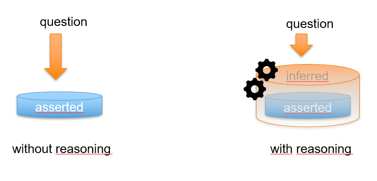

# Reasoning
# What does the reasoner do?

We can distinguish between two types of reasoning as it happens within the knowledge engine:
1. reasoning to infer new data, and 
2. reasoning for orchestration of data 

It is optional to use the reasoner, and you have to specifically opt in to enable it.
If you don't opt in, the *matcher* is used, which simply only facilitates data exchange when graph patterns match exactly (except for order of triples and variable names).

## Reasoning to infer new data

This type of reasoning is what is usually meant when talking about a reasoning in the context of the Semantic Web. In such a scenario there is a collection of facts and a collection of rules and the reasoner uses the facts and rules to infer new facts. The original facts are called the _asserted facts_ and the derived facts are called the _inferred facts_ (see figure 1).



*Figure 1: the difference between asserted and inferred facts.*

In the figure you see two databases with triples. The left database only contains asserted facts and whenever a user asks a question to this database, it answer will be sought within these asserted facts. In the right database you still see the asserted facts, but this time a collection of inferred facts on top of them is also available. These inferred facts are derived by the reasoner from the asserted facts by applying a set of rules. Now, whenever a user asks a question to the database on the right, the answer is not only sought in the asserted facts, but in both the asserted and inferred facts.

Let's give an example. Imagine a smart home scenario where lights have a state of either 'on' or 'off'. In triples this looks like:

```sparql
ex:light1 rdf:type ex:Light .
ex:light1 ex:hasState ex:on .
```

Now imagine all the on/off states of all the lights in the home are maintained as asserted facts in a database. The home owner uses an app to check which lights she left on in her home and this app checks the on/off states using the asserted facts in the database. This all works perfect and the home owner buys and installs a new _dimmable_ light. Unfortunately, the app does not check whether the new dimmable light is on or off, since a dimmable light is not either on/off, but has a light intensity between 0 and 100. So, its triples look like:

```sparql
ex:light2 rdf:type ex:DimmableLight .
ex:light2 ex:hasIntensity "23"^^xsd:integer .
```

Now, an update of the app to also check intensity levels of dimmable lights could solve this problem, but updates do not always happen. By using the reasoning capabilities, this problem can also be solved without any updates to the app. This solution would involve telling the reasoner that a DimmableLight (which is also a Light) is on if its light intensity level is larger than 0. Such a rule (which is typically part of the Knowledge Model) looks like:

```sparql
if
  ?light rdf:type ex:DimmableLight .
  ?light ex:hasIntensity ?intensity .
  ?intensity ex:isLargerThan 0 .
then
  ?light ex:hasState ex:on .
else
  ?light ex:hasState ex:off .
end
```

Now, the (legacy) app is able to check the dimmable light's on/off state. This can also be called 'forward compatibility', i.e. a legacy app is compatible with future developments.

## Reasoning to orchestrate data exchange

This type of reasoning is less obvious and requires some explanation. It is particularly useful in a scenario where data is scattered amongst heterogeneous knowledge bases. Instead of periodically transforming data from each of those knowledge bases into a uniform format and collecting it in a central database, this orchestration method allows the data to stay at its source and only retrieve those facts whenever they are needed.

For the reasoner to orchestrate this, it requires an overview of all the currently available knowledge bases and their capabilities. These capabilities are called knowledge interactions (see also [Conceptual Framework](./conceptual_framework.md)) and each knowledge base typically has multiple of them. Each knowledge interaction represents a single capability of a knowledge base and describes this capability using only the concepts and relations defined in the common ontology. Our assumption is that every capability of a possible knowledge base (i.e. a machine learning model, user app, database or service) can be described in such a way.

With this overview of the available capabilities, the reasoner is able to answer questions about knowledge that is scattered over multiple knowledge bases. This works as follows. For every knowledge interaction of every available knowledge base, the Smart Connector determines whether it is relevant and if so, it updates its state accordingly. This state consists of a collection of rules that represent the available capabilities and whenever the reasoner applies such a rule to answer a certain question (i.e. using backward reasoning), during the execution of the rule the relevant Knowledge Base is contacted and the data is retrieved on the fly.

For example, there are three knowledge bases called App, Measurements and Temperature Converter. The scenario is that the App gives the user access to all available measurements in degrees Fahrenheit. However, the Measurements Knowledge Base only stores measurements in degrees Celcius. The idea is that the reasoner is able to use the Temperature Converter Knowledge Base to convert the availble measurements in degrees Celcius into the requested measurements in degrees Fahrenheit. The knowledge interactions of the different Knowledge Bases are of the following:

```sparql
App knowledge interaction (ASK):
  pattern:
    ?meas rdf:type saref:Measurement .
    ?meas saref:tempInFahrenheit ?temp .

Measurements knowledge interaction (ANSWER):
  pattern:
    ?m rdf:type saref:Measurement .
    ?m saref:tempInCelcius ?t .

Temperature knowledge interaction (REACT):
  argument pattern:
    ?mm rdf:type saref:Measurement .
    ?mm saref:tempInFahrenheit ?tf .
  result pattern:
    ?mm rdf:type saref:Measurement .
    ?mm saref:tempInCelcius ?tc . 
```

Now, these knowledge interactions will result in the following backward rules (see also (see also [Conceptual Framework](./conceptual_framework.md)) in the App's Smart Connector:

```sparql
if
  ?m rdf:type saref:Measurement .
  ?m saref:tempInCelcius ?t .
then
  retrieveDataFromKnowledgeBase(Measurements)
end

if
  ?mm rdf:type saref:Measurement .
  ?mm saref:tempInFahrenheit ?tf .
then
  ?mm rdf:type saref:Measurement .
  ?mm saref:tempInCelcius ?tc .
  retrieveDataFromKnowledgeBase(Temperature Converter) 
end

```

The App asks its SmartConnector for measurements in degrees Fahrenheit, but the Measurements Knowledge Base (KB) only contains measurements in degrees Celcius. The reasoner will therefore apply the backward rule of the Temperature Converter to every measurement that the Measurements KB returns. So, the Measurements KB returns the following RDF:

```sparql
:m1 rdf:type saref:Measurement .
:m1 saref:tempInCelcius 21 .

:m2 rdf:type saref:Measurement .
:m2 saref:tempInCelcius 18 .

:m3 rdf:type saref:Measurement .
:m3 saref:tempInCelcius 24 .
```

The Temperature Converter KB is able to convert this into:

```sparql
:m1 rdf:type saref:Measurement .
:m1 saref:tempInCelcius 69.8 .

:m2 rdf:type saref:Measurement .
:m2 saref:tempInCelcius 64.4 .

:m3 rdf:type saref:Measurement .
:m3 saref:tempInCelcius 75.2 .
```

Which is the data that can be returned by the Smart Connector to the App KB as the answer to its query. But data exchange does not only involve asking questions and getting answers (i.e. pulling data), it often also entails publishing data to subscribers (i.e. pushing data). If we modify the Measurements KB of the above example into a Temperature sensor that periodically publishes the latest measurement in degrees Celcius. The knowledge interactions of the App and Temperature Converter KBs remain the same and the Temperature Sensor KB has the following knowledge interaction:

```sparql
Temperature Sensor knowledge interaction (POST):
  argument pattern:
    ?m rdf:type saref:Measurement .
    ?m saref:tempInCelcius ?t .
```

Note that the only difference with the knowledge interaction of the Measurements KB is that the output knowledge is no longer requestable, but only subscribable.
This Temperature Sensor knowledge interaction results in the following *forward* rule in the Smart Connector of the Temperature Sensor:

```sparql
if
  ?m rdf:type saref:Measurement .
  ?m saref:tempInCelcius ?t .
then
  sendDataToOtherKnowledgeBases()
end
```

This means that whenever the Temperature Sensor publishes a new measurement, it will get pushed to subscribed KBs (in this case the App KB). The Smart Connector of the App KB will receive this measurement where its reasoner works with the following *forward* rules:

```sparql

if
  ?mm rdf:type saref:Measurement .
  ?mm saref:tempInCelcius ?tc .
then
  retrieveDataFromKnowledgeBase(Temperature Converter)
  ?mm rdf:type saref:Measurement .
  ?mm saref:tempInFahrenheit ?tf .
end

if
  ?m rdf:type saref:Measurement .
  ?m saref:tempInFahrenheit ?t .
then
  sendDataToKnowledgeBase()
end

```

Now, upon receiving the new measurement the rule for the Temperature Converter will trigger and convert the measurement into Fahrenheit. Once this is done, the new Measurement in degrees Fahrenheit will be send tot the App KB by the other rule. The App can now update its GUI with the latest measured temperature in degrees Fahrenheit.

From these example it becomes clear that a reasoner can also be used to orchestrate data exchange between different Knowledge Bases. 

## Full example
In `examples/reasoner/` in the Knowledge Engine repository, you can find a complete example in a Docker Compose project.
That example is a variant on the unit conversion orchestration.


## Enabling the reasoner when using the Java API
### Java
If using the Java API, you can enable the reasoner in your `SmartConnector` by calling:

```java
smartConnector.setReasonerEnabled(true);
```

Then, any **proactive** knowledge interaction that you trigger in the smart connector will use the reasoner.

### REST API
If using the REST API, you can enable the reasoner in your smart connector by adding the `reasonerEnabled` property during knowledge base registration:

```json
{
  "knowledgeBaseId": "http://example.org/kb-with-reasoner-enabled",
  "knowledgeBaseName": "My reasonable knowledge base",
  "knowledgeBaseDescription": "This is an example knowledge base with the reasoner turned on.",
  "reasonerEnabled": true
}
```

Subsequently, any **proactive** knowledge interaction that you register and use will use the reasoner.

## Performance warning
When using large graph patterns and/or many bindings, the reasoner's time and memory consumption doesn't scale very well.
In those cases, you may experience out-of-memory issues, or very long processing times.
For this reason, it is advised to only use the reasoner with small graph patterns.