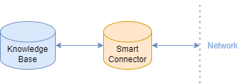
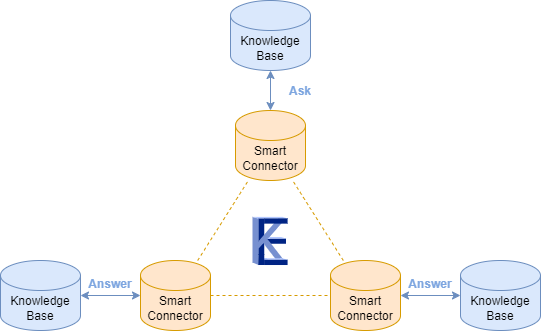

# TKE-EDC Example
This example focuses on the Eclipse Dataspace Components (EDC) integration of the Knowledge Engine.
If you just want to learn about the functioning of the Knowledge Engine and do not know about EDC, this example is not the right place to start. \
In this text we assume basic knowledge about EDC (The [adopters manual](https://eclipse-edc.github.io/documentation/for-adopters/) is a good place to start) and International  Data Spaces (IDS, see [here](https://internationaldataspaces.org/)). \
If you are already familiar with the Knowledge Engine you can skip the next part.

## Introduction to the Knowledge Engine
The Knowledge Engine is a system for seamlessly connecting data sources.
Each data source, which can provide and/or consume information, is also called a Knowledge Base.
Multiple Knowledge Bases that communicate together form a network.
To communicate with such a network, each Knowledge Base uses a component called a Smart Connector.
This Smart Connector takes care of all communication between a Knowledge Base and others in the network.
The Smart Connectors are part of the Knowledge Engine solution and should not be confused with the EDC-IDS Connectors.




Within a network, each Knowledge Base announces what information it wants to _receive_, and what information it can _provide_ through its Smart Connector.
The Knowledge Engine will determine who to contact for each information request.

There are 4 types of information requests, also called Knowledge Interactions, in the Knowledge Engine: Ask, Answer, Post, React.
Ask is to request information. An answer provides an Answer to a request for information, i.e. Ask.
Post is to announce information. 
A React gives you the ability to subscribe to information and thus react to information that is announced through a Post.

These Knowledge Interactions are first registered at the Smart Connector. 
After they have been registered, they can be executed.

For more information on the Knowledge Engine, check out the [documentation](https://docs.knowledge-engine.eu/).

## About the Integration with EDC
The current integration between the Knowledge Engine and EDC-IDS focuses on the authentication of messages.
All messages that are sent contain an authentication code.
The TKE-EDC integration is aimed at providing and validating these authentication codes.
The used components of EDC implement the Data Space Protocol (DSP) and the Decentralized Claims Protocol (DCP), an overlay of DSP.
These protocols are used to establish security and trust within the network based on the decentralized identity model (see [here](https://eclipse-edc.github.io/documentation/for-adopters/identity-hub/)).

! IMPORTANT ! The EDC integration is currently still under development. Expect bugs, frequent changes and updates. This implementation is certainly not suitable for production environments.
 
We currently use the Control Plane, Data Plane and Identity Hub components of EDC, which are all heavily customizable.
The TKE-EDC integration is made specifically for the extended EDC components developed within TNO, that are also publicly available, see the Docker Compose file in this folder.
We assume pregenerated Verifiable Credentials that are loaded into Identity Hub at start-up.
Currently we cannot give a definitive easiest way to generate these yourself, but will be future work.


## Running the TKE-EDC example
This example uses 3 knowledge bases as depicted below.



One knowledge base (Alice) asks for information and the other two (Bob , Carol) provide an answer to the question. \
Explore the Docker Compose file in this folder to learn more about the setup. \
Extra care has been taken to simulate locally a setup that reflects a distributed setup across multiple machines. See the notes on networking in the Compose file.
The setup requires adding the following to your `/etc/hosts` file:
```
127.0.0.1       host-authority
127.0.0.1       host-alice
127.0.0.1       host-bob
127.0.0.1       host-carol
```

### Executing the example
Example can be executed using Docker, follow these steps:
1. In the `examples/edc-example` directory in this project, execute `docker compose build`. 
2. Several containers are dependent on the initialization of others, but there is currently no method implemented to start these in the correct order. In the `examples/edc-example` directory in this project, execute

```
docker compose up -d bob-identity-hub bob-control-plane alice-identity-hub alice-control-plane authority-identity-hub registration-service nginx-proxy alice-http-data-plane bob-http-data-plane carol-identity-hub carol-control-plane carol-http-data-plane
```

This starts three EDC-IDS Connectors.
3. Wait around 20 seconds to give the EDC Connectors time to finish setting up. Then, execute 

```
docker compose up alice-ker bob-ker alice-kb bob-kb carol-ker carol-kb knowledge-directory -d
```

to start three KERs, three linked Knowledge Bases and a Knowledge Directory.

You can inspect the logs of the containers using `docker compose logs -f {component-name}`.
After a moment (+-30 seconds), the logs will stabilise when the connectors have finished initiating the various data flows.
You can then see that one KER (`runtime-1`) asks for information, a second KER (`runtime-2`) answers with `http://example.org/Math, http://example.org/Science` and the third (`runtime-3`) answers with `http://example.org/Magazines, http://example.org/Books`.

To stop the example, execute `docker compose down`.
