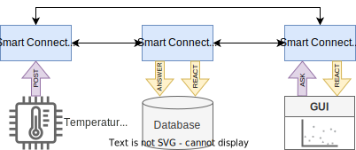

# REST API example

This Docker Compose project contains three knowledge bases implemented in Python that connect to the Knowledge Engine through the REST API.

The setup of the knowledge bases is illustrated as follows:



*Arrows that point up are proactive interactions (triggered by the knowledge base itself) whereas arrows that point down are reactive interactions (triggered by other knowledge bases).*

All knowledge interactions in this setup use the same graph pattern (so the ASK/ANSWER and POST/REACT pairs all match):

```
?sensor rdf:type saref:Sensor .
?measurement saref:measurementMadeBy ?sensor .
?measurement saref:isMeasuredIn saref:TemperatureUnit .
?measurement saref:hasValue ?temperature .
?measurement saref:hasTimestamp ?timestamp .
```

## Temperature sensor
The temperature sensor knowledge base (called `sensor` in the example) regularly publishes temperature measurements through a POST knowledge interaction.

## Database
The database (called `storage` in the example) listens for new measurements, and can be queried for historical measurements.

## GUI
The GUI (called `ui` in the example) commences by retrieving all historical measurements and displaying them. Then it starts listening for live updates that it also displays.

# Running it

To run the example, and only show the 'GUI' results, do the following:

```
docker-compose up --build --force-recreate -d && docker-compose logs -f ui
```

You should see output similar to this:

```
[HISTORICAL] Temperature was 18.157762736025088 units at 2023-02-03T13:26:23.226876
[HISTORICAL] Temperature was 21.93865480633777 units at 2023-02-03T13:26:27.399687
[HISTORICAL] Temperature was 15.033330953610719 units at 2023-02-03T13:26:25.372232
[NEW!] Live temperature is 18.44299690674754 units at 2023-02-03T13:26:29.445521
[NEW!] Live temperature is 21.2856473490042 units at 2023-02-03T13:26:31.503030

# more will appear indefinitely
```

When you're done, shut the services down with:

```
docker-compose down
```
